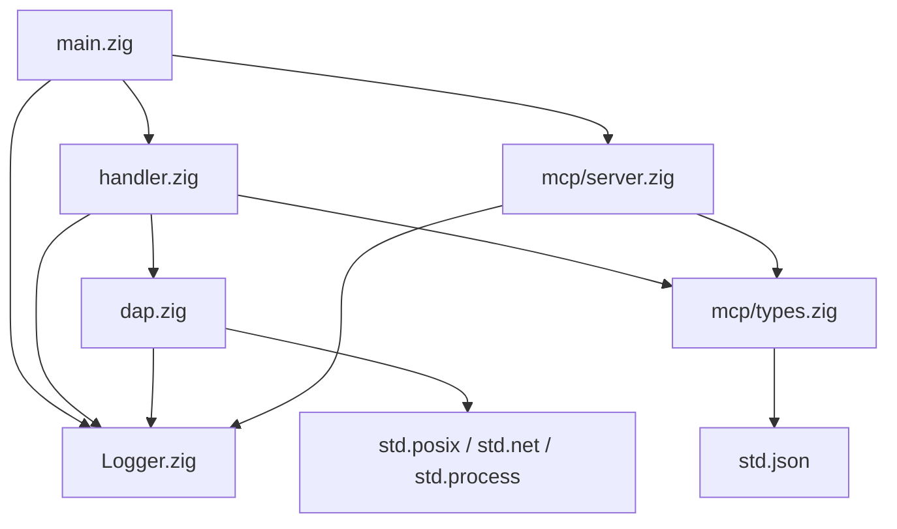
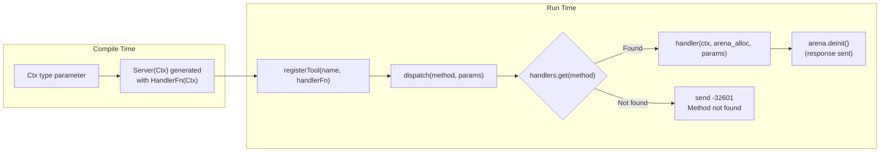
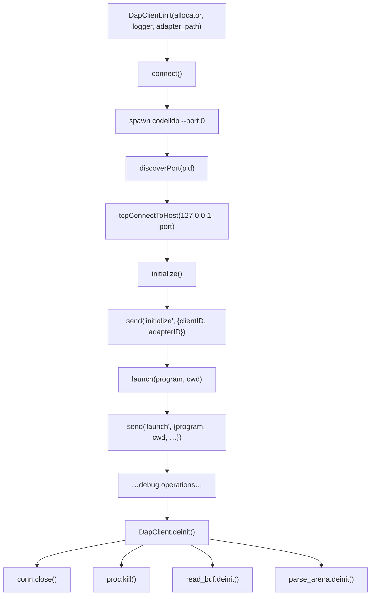
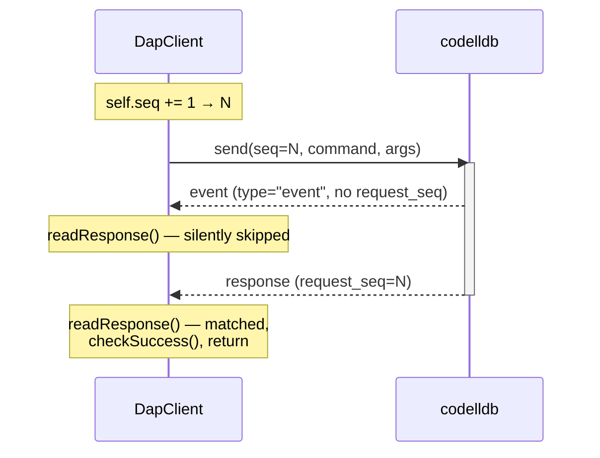
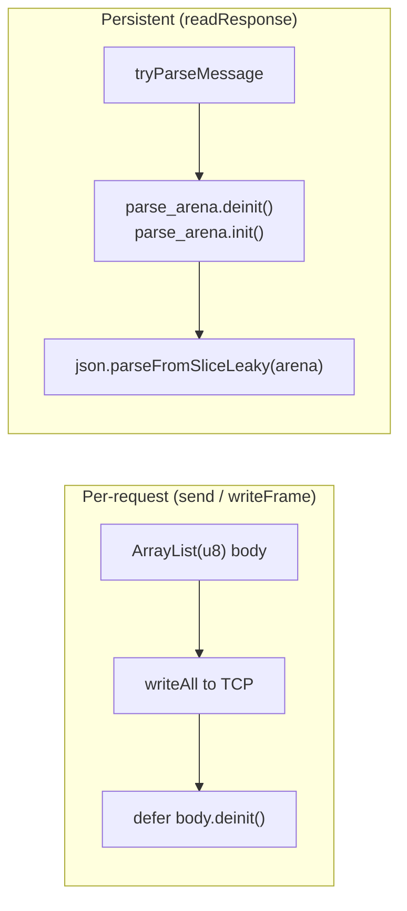
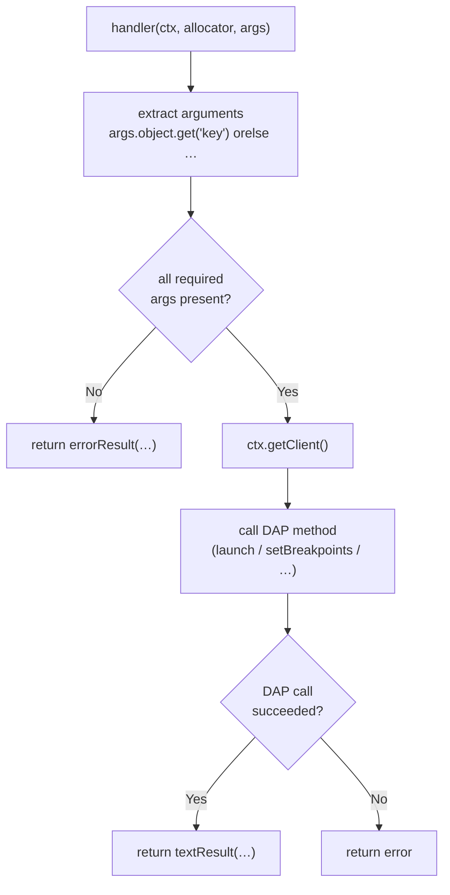
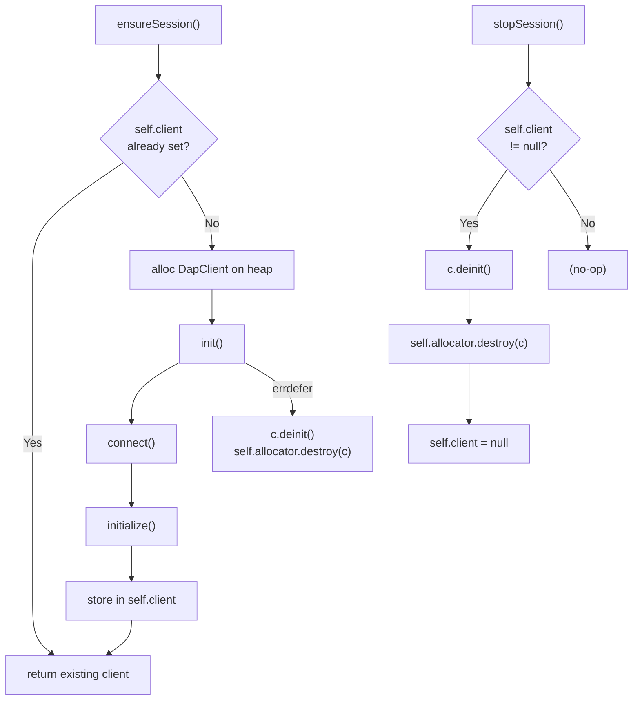
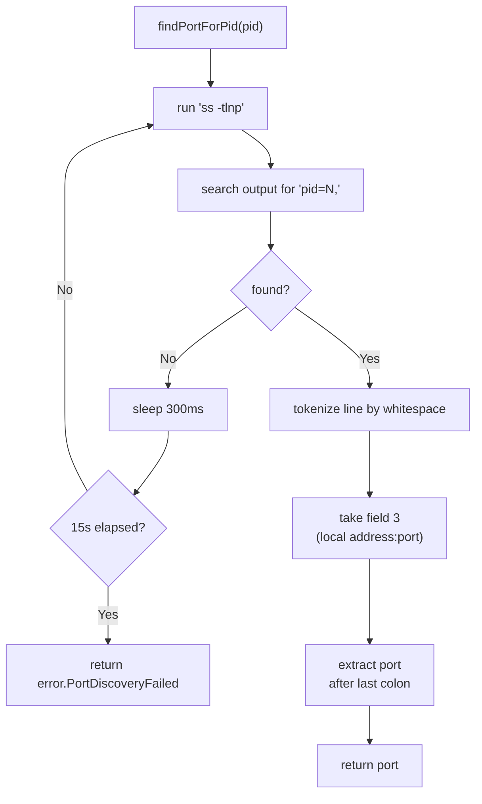
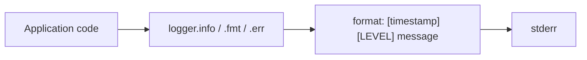

# Architecture

## Overview

`debugger-mcp` is a zero-dependency Zig binary that acts as a protocol bridge between MCP (Model Context Protocol) and DAP (Debug Adapter Protocol). It allows LLM-based tools like OpenCode to drive native code debugging through codelldb/LLDB.

## Module Dependencies



## Generic Server Pattern `Server(Ctx)`

The MCP server uses Zig's comptime generics to decouple protocol handling from application logic:

```zig
pub fn Server(comptime Ctx: type) type {
    return struct {
        ctx: *Ctx,
        handlers: std.StringHashMap(HandlerFn),
        // ...
    };
}
```

`HandlerFn` is a function pointer type: `*const fn (ctx: *Ctx, allocator: std.mem.Allocator, params: ?json.Value) anyerror!json.Value`



This pattern enables:
- **Compile-time dispatch** — no vtable, no interface overhead
- **Type safety** — the handler context type is checked at compile time
- **Reusability** — the server could be instantiated with any context type

## DAP Client Design

### Connection Lifecycle



### Request-Response Correlation

DAP uses a monotonic `seq` counter for requests. Responses carry a `request_seq` field matching the request's `seq`. The `send()` method orchestrates this flow:



### Memory Strategy

Two allocation patterns coexist:



- **Per-request arenas**: `send()` creates a temporary `ArrayList(u8)` to build the JSON body, freed after `writeAll`
- **Persistent parse arena**: `parse_arena` is reused across all response reads — deinitialized and re-created before each new parse

## Tool Handler Pattern

Each handler is a free function with the signature:

```zig
fn handler(ctx: *Handler, allocator: std.mem.Allocator, args: ?json.Value) !json.Value
```



### Session Lifecycle

`Handler.ensureSession()` implements lazy singleton initialization:



`stopSession()` reverses this: deinit, destroy, set null.

## Port Discovery



## Error Handling Strategy

| Layer | Approach |
|---|---|
| MCP parse errors | Send JSON-RPC `-32700` error |
| Unknown methods | Send `-32601` Method not found |
| Missing params | Send `-32602` Invalid params |
| Handler failures | Send `-32603` Internal error with message |
| DAP protocol errors | Convert to error results or propagate |
| Stdin read errors | Fatal — `server.run()` returns |
| Dispatch errors | Logged, server continues |

## Key Design Decisions

1. **Inline tool schemas**: The `tools/list` response is a hardcoded JSON string. This is simple but requires manual updates when tools change. (An alternative would be building it programmatically from registered handler metadata.)

2. **TCP over stdio for DAP**: codelldb is spawned with `--port 0` rather than using stdin/stdout for DAP. This adds port discovery complexity but matches codelldb's recommended usage pattern.

3. **No DAP event processing**: DAP events (stopped, continued, breakpoint) are discarded. The server does not push MCP notifications. This means the LLM client must poll for state changes rather than being notified.

4. **Single-threaded synchronous**: All I/O is blocking with polling timeouts. No async runtime, no threads. This keeps the code simple but limits concurrency.

5. **Zero dependencies**: The entire project uses only Zig's standard library. No JSON library, no HTTP library, no MCP or DAP SDK.

## Debug Logging

The `Logger` module writes structured log lines to stderr:



Default level is `info`. Change at initialization in `main.zig`:
```zig
var logger = log_mod.Logger.init();
logger.min_level = .debug;
```
